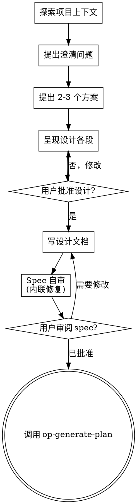

# 从需求到设计规格

> 本 skill 参考 [superpowers:brainstorming](https://github.com/obra/superpowers)（Copyright (c) 2025 Prime Radiant, Inc.），本土化适配 harness 工作流。
> 脚本目录 `scripts/` 和 `visual-companion.md` 直接取自 superpowers，原作者保留版权。

通过自然的协作对话把需求转成完整的设计规格。

先理解当前项目上下文，然后一次一个问题地细化需求。理解清楚要做什么后，呈现设计并获取用户确认。

<HARD-GATE>
在呈现设计并获得用户批准之前，不要调用任何实现 skill、写任何代码、搭建任何项目、或执行任何实现操作。**无论项目看起来多简单，都适用。**
</HARD-GATE>

## 模式选择

**默认：深度模式**——按 checklist 步骤 1-8 完整走，一问一答协作讨论。

**快速模式**：仅当用户**明确说**以下关键词时才走快速：
- "快速模式"、"快速决定"、"直接生成"、"快速生成"、"不用讨论了"
- 或 intake/op-debt2tasks 调用时指定快速模式

进入 skill 后先确认：

```
为 {TID} "{title}" 生成 spec。

默认深度讨论，逐项确认目标/范围/方案。说"快速"则我直接出完整 spec 供你审阅。
开始？
```

## 反模式："这太简单了不需要设计"

每个项目都走这个流程。一个 todo list、一个工具函数、一个配置变更——全部。所谓"简单"项目正是未经审视的假设造成最多浪费的地方。设计可以短（真正简单的项目几句话即可），但**必须呈现并获得批准**。

## Checklist

必须为以下每项创建 task 并按顺序完成：

1. **探索项目上下文**——检查文件、文档、最近提交
2. **适时提供 visual companion**——不在一开始。首次遇到"看图比读文字更直观"的问题时才提（单独一条消息）；用户同意后浏览器标签页打开。如果始终没有视觉问题，永不提。见下文 Visual Companion 段。
3. **提出澄清问题**——一次一个，理解目的/约束/成功标准
4. **提出 2-3 个方案**——带 trade-off 和你的推荐
5. **呈现设计**——各段按复杂度调整篇幅，每段后获取用户确认
6. **写设计文档**——保存到 `docs/harness_execution/tasks/{TID}/spec.md`
7. **spec 自审**——快速内联检查占位符、矛盾、歧义、范围（见下文）
8. **用户审阅 spec**——要求用户在继续前审阅 spec 文件
9. **过渡到实施**——调用 op-generate-plan skill 创建实施计划

## 流程



**终点是调用 op-generate-plan。** 不要调用任何其他实现 skill。brainstorming 之后唯一调用的 skill 是 op-generate-plan。

## 过程细节

**理解需求：**

- 先了解当前项目状态（文件、文档、最近提交）
- 在问细节问题前，先评估范围：如果请求描述了多个独立子系统（如"做一个平台，含聊天、文件存储、计费、分析"），立即标记。不要花时间细化一个需要先拆分的项目。
- 如果项目太大、一个 spec 装不下，帮助用户拆分成子项目：独立的部分是什么、它们怎么关联、按什么顺序做？然后对第一个子项目走正常设计流程。每个子项目各自走 spec → plan → 实现循环。
- 对于范围合适的项目，一次一个问题地细化需求
- 尽量用选择题，但开放式也行
- 每条消息只一个问题——如果话题需要更多探索，拆成多个问题
- 专注于理解：目的、约束、成功标准

**探索方案：**

- 提出 2-3 个不同方案，带 trade-off
- 用对话方式呈现选项，附上你的推荐和理由
- 先说推荐方案，解释为什么

**呈现设计：**

- 一旦你认为自己理解了要做什么，呈现设计
- 各段按复杂度调整篇幅：直截了当则几句话，有细微差别则 200-300 字
- 每段后问"这段对吗？"
- 覆盖：架构、组件、数据流、错误处理、测试
- 如果某些地方说不通，随时回去澄清

**为隔离和清晰而设计：**

- 把系统拆成更小的单元，每个单元有单一清晰职责，通过明确定义的接口通信，可以独立理解和测试
- 对每个单元，你应该能回答：它做什么、怎么用它、它依赖什么？
- 能不读内部实现就理解一个单元做什么吗？能改内部实现而不破坏调用方吗？不能的话，边界需要重新设计。
- 更小、边界清晰的单元也让你更容易处理——你能在上下文中一次性把握的代码推理更可靠，文件聚焦时代码编辑更准确。当文件变得很大，通常是它做了太多事的信号。

**在已有代码库中工作：**

- 在提变更前探索当前结构。遵循已有模式。
- 当已有代码有问题且影响当前工作（如文件过大、边界不清晰、职责纠缠），把针对性的改进纳入设计——就像优秀开发者在工作中改善代码一样。
- 不提无关的重构。专注于当前目标所需。

## 设计之后

**文档：**

- 把验证过的设计（spec）写到 `docs/harness_execution/tasks/{TID}/spec.md`
- 使用 `template/harness_execution/tasks/{TID}/spec.md` 模板结构
- 提交设计文档到 git

**Spec 自审：**
写完后，用全新眼光审视 spec 文档：

1. **占位符扫描：** 有没有 "TODO"、"TBD"、不完整的段、或模糊的需求？修复。
2. **内部一致性：** 各段之间有没有矛盾？架构和功能描述对得上吗？
3. **范围检查：** 是否聚焦到一个实现计划能覆盖的范围，还是需要拆分？
4. **歧义检查：** 有没有需求可以被两种方式解读？有就明确选一种。

发现问题直接内联修复。不需要再审——修完继续。

**用户审阅关卡：**
spec 自审通过后，要求用户在继续前审阅 spec：

> "Spec 已写入 `docs/harness_execution/tasks/{TID}/spec.md`。请审阅，如需修改告诉我，然后我们开始写实施计划。"

等用户回复。如果他们要改，改完重新自审。只有用户批准后才继续。

**实施：**

- 调用 op-generate-plan skill 创建详细实施计划
- 不要调用任何其他 skill。op-generate-plan 是下一步。

## 快速模式

仅当用户明确说"快速"时走此模式。**不跳过设计过程**——而是 skill 自己完成 checklist 的步骤 1-7，不等用户逐项确认：

1. 自己探索项目上下文
2. 自己判断边界和约束
3. 自己提 2-3 个方案并选最优
4. 自己写完整 spec
5. 自己跑自审
6. 输出 spec 全文 + 关键决策摘要（选了哪个方案、为什么），请用户审阅

用户只需在最后审阅。说"改"才改，否则通过进入 op-generate-plan。

**关键**：快速模式不把判断丢回给用户。方案选择、边界划定、文件结构——skill 自己做决定。但必须汇报决策理由。

## 关键原则

- **一次一个问题**——不要一次抛多个问题
- **尽量用选择题**——比开放式容易回答
- **无情 YAGNI**——从所有设计中删除不必要的功能
- **探索替代方案**——确定前总要提 2-3 个方案
- **增量验证**——呈现设计，获取批准，再继续
- **灵活**——说不通就回去澄清

## Visual Companion

基于浏览器的可视化辅助，在 brainstorming 期间展示 mockup、图表和视觉选项。是工具——不是模式。接受 companion 意味着它在适合可视化的问题时可用；不意味着每个问题都走浏览器。

**适时提供（不在开始）：** 不在开头提。等到首次遇到真正"看图比读文字更直观"的问题——真正的 mockup/布局/图表问题，不只是 UI 话题——时才提，单独发一条消息：

> "这部分用图展示会更清楚——我可以开个浏览器页面画 mockup/架构图/方案对比。要开吗？"

**这条消息必须独立。** 只有邀请——不加澄清问题、总结或其他内容。等用户回复。如果接受，用 `--open` 启动服务器，浏览器自动打开。如果拒绝，继续纯文字，不再提，除非用户主动要求。

**每次问题判断：** 即使用户接受了 companion，**每个问题**决定用浏览器还是终端。测试标准：**用户看比读更好理解吗？**

- **用浏览器**：内容本身是视觉的——UI mockup、线框图、布局对比、架构图、并排视觉设计
- **用终端**：内容是文字或表格——需求问题、概念选择、tradeoff 列表、A/B/C/D 文字选项、范围决策

一个关于 UI 话题的问题不自动等于视觉问题。"你想要什么类型的 wizard？"是概念问题——用终端。"这两种 wizard 布局哪个更好？"是视觉问题——用浏览器。

如果用户同意 companion，在继续前读详细指南：
`skills/op-generate-spec/visual-companion.md`

启动服务器：
```bash
scripts/start-server.sh --project-dir /path/to/project --open
```

停止服务器：
```bash
scripts/stop-server.sh $SESSION_DIR
```

## 相关文件

| 文件 | 用途 |
|---|---|
| `template/harness_execution/tasks/{TID}/spec.md` | spec 模板 |
| `docs/harness_blueprint/prd.md` | 产品需求 |
| `docs/harness_blueprint/spec.md` | 全局总纲 |
| `docs/harness_blueprint/architecture.md` | 系统架构 |
| `docs/harness_blueprint/domain.md` | 领域模型 |
| `skills/op-generate-spec/visual-companion.md` | Visual companion 详细指南 |
| `skills/op-generate-spec/spec-document-reviewer-prompt.md` | Spec 审阅提示词模板 |
| `skills/op-generate-plan/SKILL.md` | 下一步：op-generate-plan |
